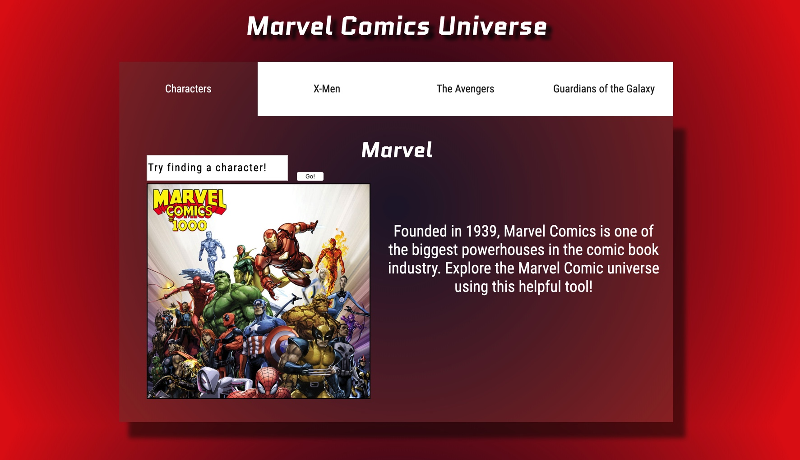

# Avengers API Database

## UI Element
### **Goal**
>The goal of this project was to pick a UI pattern and an API. Then build out the UI pattern to work with the API you chose.

#### **Languages**
>HTML, CSS, JavaScript

## **Download**
>To download this project, fork and clone the repository. Open in your browser using a server to access the entire Marvel character database.

  
  
For my website I decided to create a set of tabs. The first tab is an introduction to the site and holds a search bar  
to search for any of the almost 1500 Marvel characters within the Marvel API.  
For the rest of the tabs I decided to split each one into several different Marvel character superhero teams;  
the X-Men, the Avengers, and the Guardians of the Galaxy.  

##### Special Thanks
Noah helped me get access to the Marvel API and my brother-in-law Scott helped me store all the characters from the API locally  
as to not make excessivally large calls to the API over and over and over again. My JavaScript initially makes several calls to the API  
to get every character and then stores them in the local browser storage so anytime you pull the page back up it doesn't have to load again.
